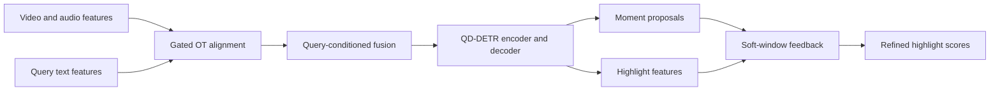

<p align="center"></p>

<p align="center"><b>Find the moment. Refine the highlight.</b><br>PyTorch · Optimal transport · Video-language alignment · Audio-visual retrieval</p>
<p align="center"><a href="README.zh-CN.md">简体中文</a> · <a href="#reproduce-the-results">Reproduce</a> · <a href="docs/METHOD.md">Method</a> · <a href="docs/EXPERIMENTS.md">Experiments</a></p>

OCS-DETR is my final-year project on text-guided video moment retrieval and highlight detection. It extends the **[QD-DETR baseline](https://github.com/wjun0830/QD-DETR)** with gated optimal-transport alignment and query-conditioned fusion. Building on **[TR-DETR's HD–MR task-interaction idea](https://github.com/mingyao1120/TR-DETR)**, it further refines moment-to-highlight feedback with proposal-weighted soft windows and coarse-to-fine attention fusion.

## Fixed best checkpoint · QVHighlights validation

| Moment retrieval | Result |
| :--- | ---: |
| **Average mAP** | **43.63** |
| R1 @ IoU 0.5 | 64.13 |
| R1 @ IoU 0.7 | 48.06 |
| mAP @ IoU 0.5 / 0.75 | 64.57 / 43.97 |

| Highlight detection · Very Good | Result |
| :--- | ---: |
| mAP | 39.72 |
| Hit@1 | 63.61 |

The selected audio-visual run improves average MR mAP from **41.72 to 43.63 (+1.91 percentage points)** over the recorded local QD-DETR audio baseline. All **1,550 validation queries** were rerun using the matching code and checkpoint; **14 saved summary metrics** were reproduced. This is validation-set performance of the selected best run, not a held-out test result or a multi-seed average. The baseline and final run have different seeds/configuration; the comparison measures the full system, not an isolated module ablation.


## How the model works



The transport plan aligns video and query tokens before fusion. The video branch learns a sigmoid gate; the text branch uses a learned residual scale. The second interaction stage turns several predicted moments into smooth temporal windows, combines them by proposal scores, and feeds that context back into highlight estimation.


## What the predictions look like


The figure uses saved predictions and QVHighlights annotations. An offline [interactive timeline viewer](demo/index.html) includes three examples and their saliency curves. It runs with `python -m http.server 8383 --bind 127.0.0.1` from the repository root; open `/demo/`. Raw source videos are not redistributed.

## Reproduce the results

Use Python 3.11 and PyTorch 2.14.1 for the public inference entry point. The historical experiment used PyTorch 2.1.0; the tensor-only release avoids loading its Python-object metadata. Install the CPU dependencies below, or choose the matching CUDA build from PyTorch:

```bash
git clone https://github.com/CatAlvin/OCS-DETR.git
cd OCS-DETR
python -m pip install -r requirements.txt

# Recompute the 14 metrics from all saved predictions; no GPU or weights needed.
python scripts/verify_metrics.py

# Download hash-checked model weights and an eight-query feature sample.
python scripts/download_assets.py
python scripts/evaluate.py --smoke --device cpu
```

For full inference, prepare the four official feature directories described in [DATA.md](docs/DATA.md), then run:

```bash
python scripts/evaluate.py --feature-root features --device cuda
```

The fixed model has **8,969,258 parameters**. The public weight file contains tensor state and epoch metadata only and is loaded with `weights_only=True`. Model assets are distributed through [Releases](https://github.com/CatAlvin/OCS-DETR/releases).

## Contribution and attribution

I designed and integrated the gated OT alignment, query-conditioned fusion, differentiable soft-window feedback, and audio-visual experiments, and selected and reproduced the best checkpoint. **QD-DETR provides the baseline architecture and evaluation foundation. TR-DETR provides the HD–MR interaction idea that this project further develops.** Existing upstream code and notices are retained; implementation details and attribution are in [METHOD.md](docs/METHOD.md) and [THIRD_PARTY.md](THIRD_PARTY.md).

| Artifact | Contents |
| :--- | :--- |
| [`configs/best_audio.json`](configs/best_audio.json) | Exact selected-run model/training options, with portable paths |
| [`evaluation/`](evaluation/) | Full predictions and reproduced metrics |
| [`scripts/evaluate.py`](scripts/evaluate.py) | Strict checkpoint loading and inference |
| [`qd_detr/model.py`](qd_detr/model.py) | Alignment, fusion, and HD–MR refinement |
| [`docs/EXPERIMENTS.md`](docs/EXPERIMENTS.md) | Metric definitions and comparison protocol |
