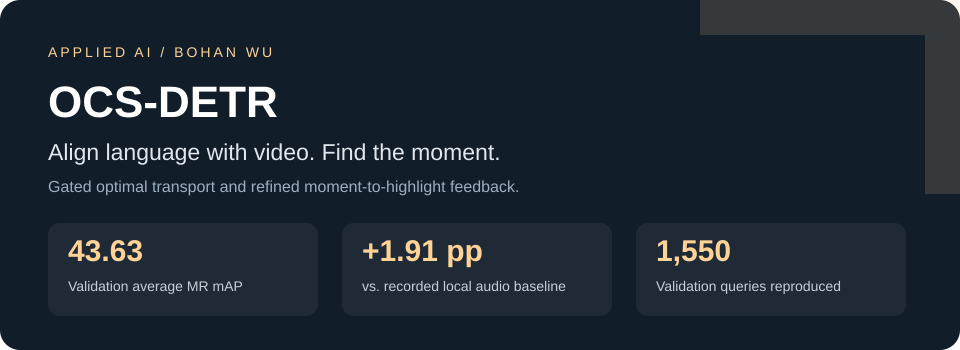
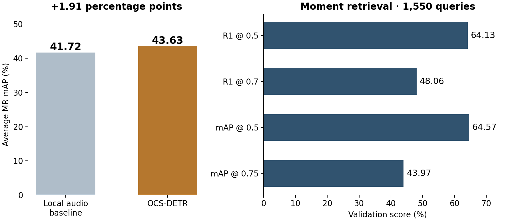
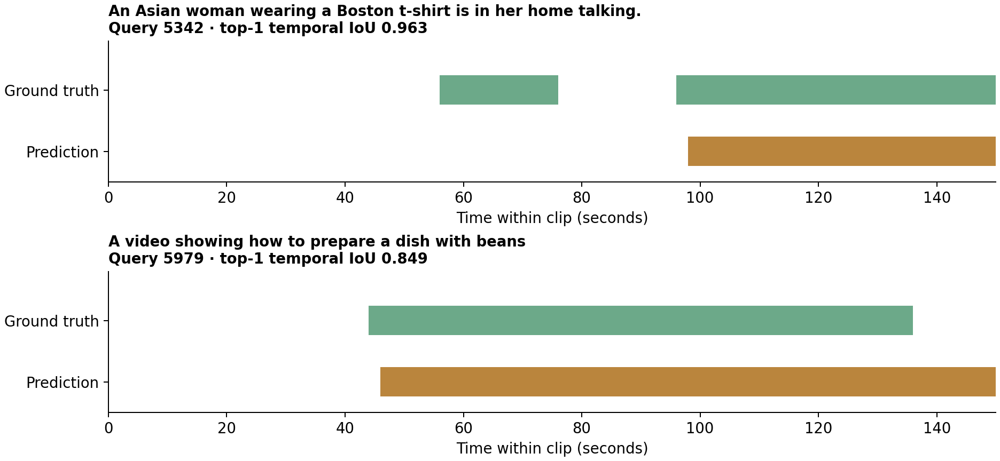

# OCS-DETR

**用自然语言定位视频片段，并进一步细化高光分数的多模态检索模型。**

[English](README.md) · [方法](docs/METHOD.md) · [实验](docs/EXPERIMENTS.md) · [复现](README.md#reproduce-the-results)

毕业设计以 **QD-DETR 为 baseline**，在 **TR-DETR 的 HD–MR 任务交互思想**上进一步改进。我设计并整合门控最优传输对齐、查询条件融合、可导软窗口与音视频实验：先改善视频和文本的对齐，再将多个预测片段作为平滑时间先验，通过粗到细注意力融合反馈到高光检测。

固定最佳音频版本在 QVHighlights 验证集取得 **43.63 Avg mAP、64.13 R1@0.5、48.06 R1@0.7**，相比本地 QD-DETR 音频基线的 41.72 Avg mAP 提高 **1.91 个百分点**。高光检测 Very Good mAP 为 **39.72**，Hit@1 为 **63.61**。使用对应代码与权重重新推理 **1,550 条验证样本**，复现了 **14 项保存指标**。

公开包提供完整预测、评测代码、配置、权重下载入口和八条样本的特征包。无需 GPU 即可重新计算完整验证集指标；下载权重后可在 CPU 上运行小样本推理。完整推理使用公开数据集的 CLIP、SlowFast、文本与 PANN 特征。

指标均对应固定最佳验证集模型，完整系统对比设置与验证流程见[实验文档](docs/EXPERIMENTS.md)。QD-DETR、TR-DETR 和其他上游实现的来源与许可证保留在[第三方归属](THIRD_PARTY.md)。
